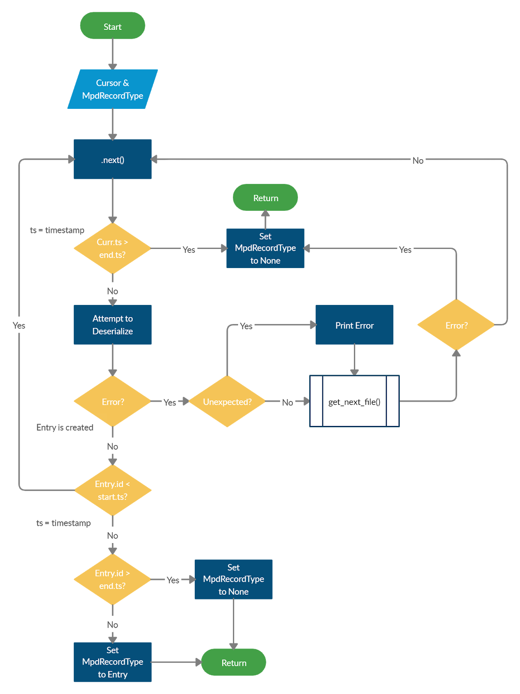
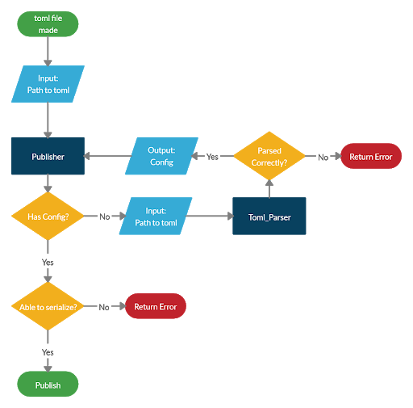
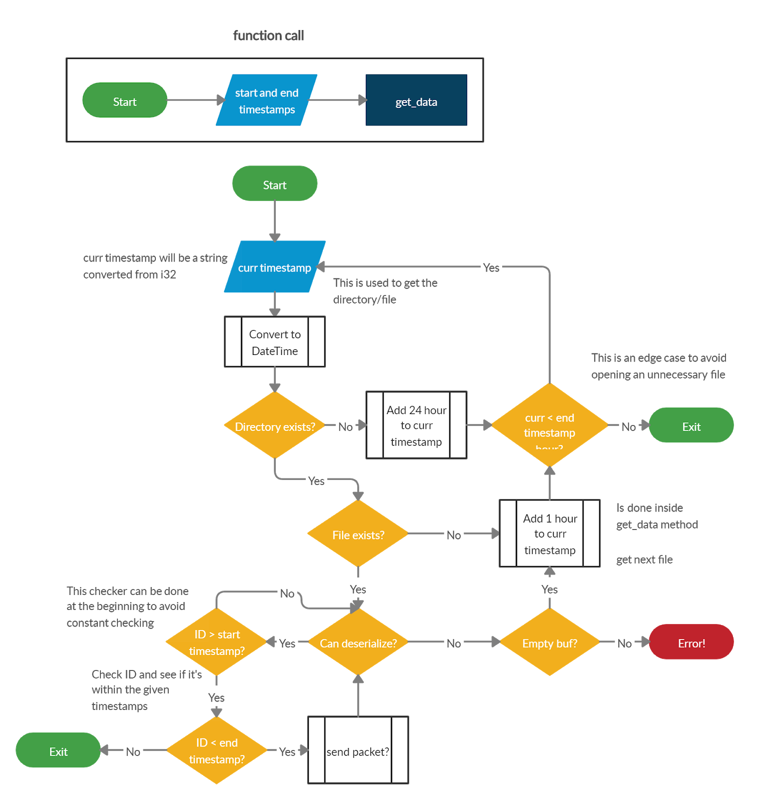

LocalStorage\
A file system designed for AirSENCE
----------------------------

### Usage
Run using the command `cargo run config/config.toml` in console. The program uses command line arguments to give the configuration.

Further usage can be found [here](https://github.com/BeniReydman/test_localStorage).

`ctrl-c` will exit the program.

### Documentation

**LocalStorage** consists of <ins>3</ins> main things:
- MQTT_Handler (`main.rs`)
- TOML_Parser (`parser.rs`)
- Database (`database.rs`)

#### MQTT_Handler

The initial starting of the program occurs in `main.rs`. Here, the config settings are grabbed using [TOML_Parser](#toml_parser) and are then used to initialize MQTT. All requests coming in through MQTT will be handled by `main.rs`.

The most important part is when a request for data comes in. For this, the function `get_data()` is used which uses a cursor to go to get data through pieces. The following flowchart describes the usage of cursor:

The other functionality can be considered trivial with internal documentation already added.

#### TOML_Parser

The TOML_Parser works by having a struct define the variables to be extracted from a TOML file. If these particular variables are not present, the program will throw an error. The following flowchart describes how the process from `main.rs` to `parser.rs` works. Please note that `Publisher` in the flowchart refers to `main.rs` calling `parser.rs`.

#### Database

The database is the most complicated part of this project. The database follows the concept of EdgeNode LocalStore described [here](https://github.com/BeniReydman/LocalStorage/blob/master/documentation/EdgeNode_LocalStore.md).

The document will describe how data is stored, however to receive data is much more difficult and is done using the following concept in this flowchart:

Thorough documentation also exists through out the code.
